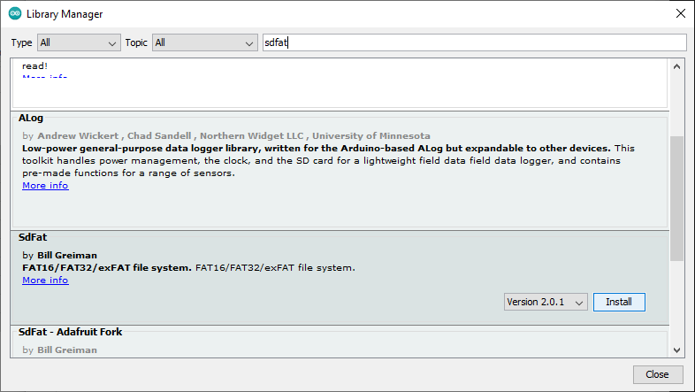

# Developer notes
*Tips and what I learnt during this project.*

## Why not use JSON on Arduino Uno ?
It's always good to use JSON in machine-to-machine communications, especially for IoT.

However, most JSON implementations, even for MCU, use nested calls which can end in a stack overflow and the Arduino Uno simply and ***silently*** crashes (which is difficult to find and fix in production).

### ArduinoJson resources
* <a href="https://arduinojson.org/" target="_blank">ArduinoJson library</a>
* <a href="https://arduinojson.org/v6/how-to/reuse-a-json-document/" target="_blank">The best way to use ArduinoJson</a>

## Restrict the API server at the very minimum on Arduino Uno
Arduino Uno has not enough memory for:
* parsing and bulding JSON objects
* handling web services nicely with several HTTP response codes (200, 400, 403, 404, 405, 408)

Limit HTTP respone code to:
* 200 OK
* 404 Not Found

## SD Card Module with Arduino
* <a href="https://github.com/greiman/SdFat" target="_blank">SdFat Version 2</a>
* <a href="https://randomnerdtutorials.com/guide-to-sd-card-module-with-arduino/" target="_blank">Guide to SD Card Module with Arduino</a>

| **SD card module** | **Wiring to Arduino Uno** | **Wiring to Arduino Mega** |
| --- | --- | --- |
| VCC | 3.3V or 5V (check module’s datasheet) | 3.3V or 5V (check module’s datasheet) |
| CS | 4 | 53 |
| MOSI | 11 | 51 |
| CLK | 13 | 52 |
| MISO | 12 | 50 |
| GND | GND | GND |

## *SdFat* library is required for long file names

#### We dont need *SdFat* library, *SD* library is good enough

If you're new with Arduino IDE:

* <a href="https://www.arduino.cc/en/Guide/Libraries" target="_blank">Getting Started > Installing Additional Arduino Libraries</a>
* <a href="https://www.digikey.com/en/maker/blogs/2018/how-to-install-arduino-libraries" target="_blank">How to Install Arduino Libraries</a>

## Author
**Jean-Michel _(Jim)_ FAURE** (December 3rd, 2020)
* company: FAURE SYSTEMS®
* mail: *ai at faure dot systems*
* github: <a href="https://github.com/fauresystems" target="_blank">fauresystems</a>
* web: <a href="https://faure.systems/" target="_blank">Faure●Systems</a>