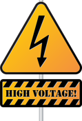
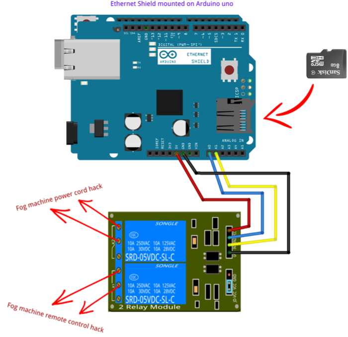
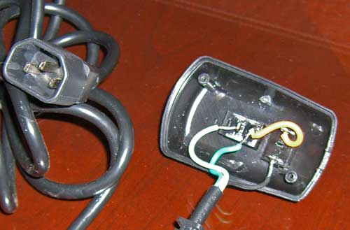
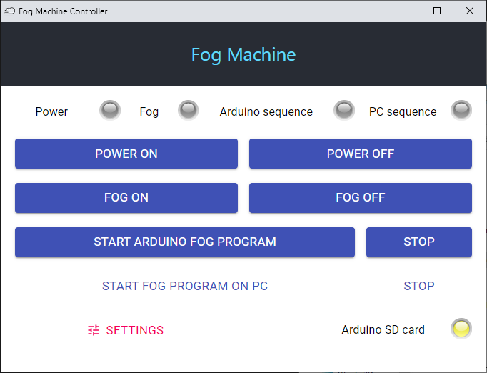

# Fog Machine Prop
*Fog Machine Prop with Arduino Uno and Ethernet Shield.*

1. Hardware requirements
2. Sofware requirements
3. How to hack a smog machine ?
4. Upload sketch on Arduino Uno
5. Install control app on Windows


## 1. Hardware requirements

### Prop control:


* <a href="https://store.arduino.cc/arduino-uno-rev3" target="_blank">Arduino Uno</a>
* <a href="https://store.arduino.cc/arduino-ethernet-shield-2" target="_blank">Arduino Ethernet Shield 2</a>
* Micro-SD card (FAT32 formatted)
* <a href="https://www.amazon.com/SMAKN%C2%AE-Active-Channel-Arduino-Raspberry/dp/B00VH86JGI/ref=sr_1_35?dchild=1&keywords=relay+shield+2&qid=1605884392&sr=8-35" target="_blank">SRD Relay Shield (**10A**)</a>

Smog machines require powerful 120/220V 10A relays because smog machine power is 400W - 700W, even more, **therefore Arduino Relay Shields with 3A relays are not sufficient**.</src>

> I recommend Arduino Uno Rev3 and Arduino Ethernet Shield 2 (W5500) but it should works with any compatible Ethernet Shield (W5100) with with Micro-SD card connector.

### Smog machine:
A smog machine with a simple wired one-button remote control that is easily hackable to replace the remote control with an SRD relay.


> Smog machines require a warm-up of 3 to 5 minutes.

### Wiring:




## 2. Sofware requirements

* <a href="https://www.arduino.cc/en/software" target="_blank">Arduino IDE</a>
* installed libraries:
    - <a href="https://www.arduino.cc/en/Reference/Ethernet" target="_blank">Ethernet</a>
    - <a href="https://www.arduino.cc/en/Reference/SD" target="_blank">SD</a>

If you're new with Arduino IDE:

* <a href="https://www.arduino.cc/en/Guide/Libraries" target="_blank">Getting Started > Installing Additional Arduino Libraries</a>
* <a href="https://www.digikey.com/en/maker/blogs/2018/how-to-install-arduino-libraries" target="_blank">How to Install Arduino Libraries</a>


## 3. How to hack a smog machine ?

> Open the wired remote control case and replace short-cut the push button wih a connection to the SRD relay shield.



This video may help: 
* <a href="https://www.youtube.com/watch?v=Y6d89PBlxrk" target="_blank">Controlling a Fog Machine with a Prop Controller or Relay</a>

You will hack the power cord too in order to control the power and start warm up the machien at the right time.

Hacking the power cord is simple, just cut one of the wires and run through an SRD relay.


## 4. Upload sketch on Arduino Uno

Install lastest Arduino IDE:
* https://www.arduino.cc/en/software

Open **FogMachine** sketch in Arduino IDE and set the prop IP address:

```cpp
String ip = "192.168.1.201"; //<<< ENTER YOUR IP ADDRESS HERE
```

Upload **FogMachine** sketch to the Arduino

```dos
Sketch uses 23866 bytes (73%) of program storage space. Maximum is 32256 bytes.
Global variables use 1222 bytes (59%) of dynamic memory, leaving 826 bytes for local variables. Maximum is 2048 bytes.

```


## 5. Install control app on Windows

Download and unzip the app archive with <a href="https://www.7-zip.org/download.html" target="_blank">7z for Windows</a>:
* <a href="https://github.com/jim-blog/fog-machine/raw/master/bin/win64/fog-controller-win64.7z">fog-controller-win64</a>



App source code is available at <a href="https://github.com/jim-blog-apps/fog-controller" target="_blank">https://github.com/jim-blog-apps/fog-controller</a>


## Author
**Jean-Michel _(Jim)_ FAURE** (December 3rd, 2020)
* company: FAURE SYSTEMS®
* mail: *ai at faure dot systems*
* github: <a href="https://github.com/fauresystems" target="_blank">fauresystems</a>
* web: <a href="https://faure.systems/" target="_blank">Faure●Systems</a>